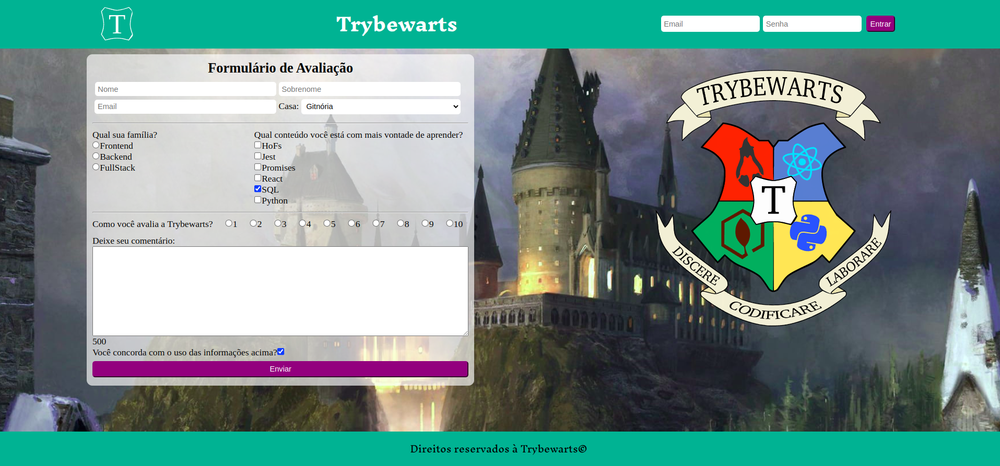

# Projeto TrybeWarts
Neste projeto, desenvolvi em dupla uma página de formulário da Escola de Magia de Trybewarts, em que as pessoas estudantes poderão enviar seus feedbacks sobre ela. O tema desse projeto é baseado na obra 'Harry Potter', de J. K. Rowling, já que programar é o mais próximo que podemos chegar de algo verdadeiramente mágico.

## :computer: Visualize este projeto:
Acesse o site pelo GitHub Pages aqui:
[https://geovannaotoni.github.io/trybe-project-trybewarts/](https://geovannaotoni.github.io/trybe-project-trybewarts/)

## :bulb: Habilidades:
Feito a partir dos conhecimentos de CSS, HTML, JavaScript, DOM e Eventos.
